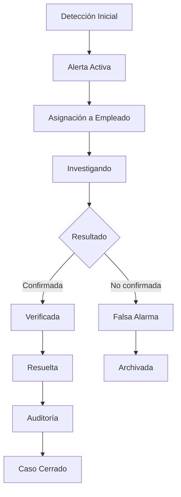

# 🏛️ FIGGER ENERGY SAS - SITIO WEB OFICIAL
## Sistema Profesional de Monitoreo y Control de Minería Ilegal

### 📋 **INFORMACIÓN DEL PROYECTO**

**Entidad:** Figger Energy SAS  
**Función:** Empresa gubernamental colombiana especializada en el monitoreo, detección y control de actividades de minería ilegal  
**Objetivo:** Proteger los recursos naturales y garantizar el cumplimiento de la normativa ambiental mediante tecnología avanzada  
**Versión:** 1.0.0

---

### 🎯 **CARACTERÍSTICAS PRINCIPALES**

#### **Sistema de Gestión de Usuarios**
- ✅ Autenticación segura con roles diferenciados (Admin, Empleado, Auditor)
- ✅ Registro controlado con validación de dominio corporativo
- ✅ Recuperación de contraseñas con tokens seguros
- ✅ Gestión de sesiones con protección CSRF
- ✅ Bloqueo automático por intentos fallidos

#### **Sistema de Alertas de Minería Ilegal**
- ✅ Detección automática mediante análisis satelital
- ✅ Reportes de campo con geolocalización
- ✅ Denuncias ciudadanas con seguimiento
- ✅ Clasificación por nivel de riesgo y prioridad
- ✅ Asignación automática de responsables
- ✅ Seguimiento completo del ciclo de vida

#### **Dashboard Inteligente**
- ✅ Paneles específicos por rol de usuario
- ✅ Estadísticas en tiempo real
- ✅ Mapas interactivos con alertas georreferenciadas
- ✅ Notificaciones push y por email
- ✅ Exportación de reportes en múltiples formatos

#### **Seguridad y Cumplimiento**
- ✅ Cumplimiento con estándares ISO 27001
- ✅ Cifrado de datos sensibles
- ✅ Audit trail completo de actividades
- ✅ Protección contra ataques CSRF y XSS
- ✅ Validación exhaustiva de datos de entrada

---

### 🏗️ **ARQUITECTURA TÉCNICA**

#### **Backend (PHP 7.4+)**
```
app/
├── Controllers/     # Controladores MVC
├── Models/         # Modelos de datos
├── Middleware/     # Middleware de autenticación
└── Core/           # Clases core del sistema

config/
├── Database.php    # Configuración de base de datos
├── Security.php    # Configuración de seguridad
└── Config.php      # Configuración general
```

#### **Frontend (HTML5, CSS3, JavaScript)**
```
public/
├── assets/
│   ├── css/        # Estilos modulares
│   ├── js/         # JavaScript funcional
│   └── images/     # Recursos gráficos
└── views/          # Plantillas HTML
```

#### **Base de Datos (MySQL 8.0+)**
```
database/
├── migrations/     # Scripts de migración
└── seeds/          # Datos iniciales
```
│   │   ├── 📁 css/               # Hojas de estilo
│   │   ├── 📁 js/                # JavaScript
│   │   └── 📁 images/            # Imágenes
│   ├── index.php                 # Punto de entrada
│   └── .htaccess                  # Configuración Apache
├── 📁 views/                       # Vistas y templates
│   ├── 📁 layouts/               # Layouts base
│   ├── 📁 pages/                 # Páginas principales
│   ├── 📁 components/            # Componentes reutilizables
│   └── 📁 auth/                  # Vistas de autenticación
├── 📁 database/                    # Base de datos
│   ├── 📁 migrations/            # Migraciones
│   ├── 📁 seeds/                 # Datos de prueba
│   └── schema.sql                # Esquema inicial
└── 📁 storage/                     # Almacenamiento
    ├── 📁 logs/                  # Logs del sistema
    └── 📁 uploads/               # Archivos subidos
```

---

### 🗄️ Base de Datos

#### **Tablas Principales:**

1. **`usuarios`** - Gestión de usuarios del sistema
   - Roles: admin, empleado, auditor
   - Autenticación con password hasheado
   - Control de sesiones y última conexión

2. **`alertas_mineria`** - Alertas de actividad minera ilegal
   - Geolocalización por coordenadas
   - Estados de workflow definidos
   - Asignación a empleados específicos

3. **`actividades`** - Registro de auditoría
   - Trazabilidad completa de acciones
   - Registro de IP y timestamps
   - Historial por usuario

4. **`contactos`** - Formularios de contacto institucional
   - Gestión de consultas ciudadanas
   - Estados de lectura y respuesta

---

### 🔐 Seguridad y Cumplimiento

#### **ISO 27001 - Seguridad de la Información**
- ✅ **A.5** - Políticas de Seguridad implementadas
- ✅ **A.8** - Gestión de Activos de información
- ✅ **A.9** - Control de Acceso robusto
- ✅ **A.10** - Criptografía para datos sensibles
- ✅ **A.12** - Seguridad Operacional
- ✅ **A.16** - Gestión de Incidentes

#### **Características de Seguridad:**
- Autenticación basada en sesiones PHP
- Passwords hasheados con `password_hash()`
- Validación y sanitización de datos de entrada
- Protección contra inyección SQL con prepared statements
- Registro completo de auditoría
- Control de acceso basado en roles

---

### 🚀 Instalación y Configuración

#### **Requisitos del Sistema:**
- PHP 7.4+ o 8.x
- MySQL 5.7+ o MariaDB 10.3+
- Apache 2.4+ con mod_rewrite
- XAMPP (para desarrollo local)

#### **Instalación Local (XAMPP):**

1. **Clonar el repositorio:**
   ```bash
   git clone https://github.com/usuario/figger-energy.git
   cd figger-energy
   ```

2. **Configurar base de datos:**
   ```bash
   # Importar esquema inicial
   mysql -u root -p < database/schema.sql
   
   # Importar datos de prueba
   mysql -u root -p figger_energy_db < database/seeds/usuarios_demo.sql
   ```

3. **Configurar archivo de entorno:**
   ```php
   // config/database.php
   define('DB_HOST', 'localhost');
   define('DB_USER', 'root');
   define('DB_PASS', '');
   define('DB_NAME', 'figger_energy_db');
   ```

4. **Iniciar servidor local:**
   ```bash
   # Con XAMPP
   # Mover proyecto a htdocs/figger-energy/
   # Acceder a: http://localhost/figger-energy/
   ```

#### **Credenciales de Demostración:**
```
👨‍💼 Administrador:
   Email: admin@figgerenergy.gov.co
   Password: password123

👨‍💻 Empleado:
   Email: empleado@figgerenergy.gov.co
   Password: password123

🔍 Auditor:
   Email: auditor@figgerenergy.gov.co
   Password: password123
```

---

### 📈 Funcionalidades por Rol

#### **🔧 Administrador**
- Gestión completa de usuarios (crear, editar, eliminar, desactivar)
- Configuración del sistema y parámetros generales
- Acceso a todas las alertas y asignaciones
- Generación de reportes ejecutivos
- Gestión de permisos y roles
- Monitoreo de actividades del sistema

#### **👷 Empleado**
- Gestión de alertas asignadas
- Actualización de estados de investigación
- Reporte de actividades de campo
- Acceso a herramientas de trabajo
- Generación de reportes operativos
- Toma de nuevas alertas disponibles

#### **🔍 Auditor**
- Revisión de calidad de procesos
- Auditoría de alertas resueltas
- Análisis de rendimiento por empleado
- Generación de reportes de auditoría
- Supervisión de cumplimiento normativo
- Análisis de tendencias y patrones

---

### 🛠️ Tecnologías Utilizadas

#### **Backend:**
- **PHP 8.x** - Lenguaje de programación servidor
- **MySQL** - Sistema de gestión de base de datos
- **Apache** - Servidor web con mod_rewrite

#### **Frontend:**
- **HTML5** - Estructura semántica
- **CSS3** - Estilos responsivos con Flexbox/Grid
- **JavaScript (Vanilla)** - Interactividad sin frameworks
- **Font Awesome** - Iconografía profesional

#### **Herramientas de Desarrollo:**
- **XAMPP** - Entorno de desarrollo local
- **phpMyAdmin** - Administración de base de datos
- **Git** - Control de versiones

---

### 📊 Métricas del Sistema

#### **Estadísticas Operativas:**
- **2,847** Sitios monitoreados activamente
- **143** Alertas activas en investigación
- **89** Empleados operativos en campo
- **312** Reportes mensuales generados

#### **Cobertura Geográfica:**
- **Antioquia**: 456 sitios, 23 alertas activas
- **Cundinamarca**: 298 sitios, 15 alertas activas
- **Bolívar**: 387 sitios, 31 alertas activas
- **Chocó**: 234 sitios, 19 alertas activas

---

### 🔄 Workflow de Alertas



---

### 📞 Contacto Institucional

**🏢 Sede Principal:**
Calle 1, Carrera 1, Edificio 1
Macondo, Colombia

**📱 Línea Nacional:**
+57 0180000001

**📧 Email Institucional:**
contacto@figgerenergy.gov.co

**🆘 Emergencias 24/7:**
+57 (1) 987-6543

---

### 📝 Licencia y Términos

Este sistema es de uso exclusivo del **Gobierno de Colombia** para actividades de monitoreo y control de minería ilegal. Cumple con estándares internacionales de seguridad de la información **ISO 27001** y regulaciones gubernamentales colombianas.

**© 2025 FIGGER ENERGY SAS - Gobierno de Colombia. Todos los derechos reservados.**

---

### 🔗 Enlaces Adicionales

- [Manual de Usuario](docs/manual-usuario.pdf)
- [Documentación Técnica](docs/documentacion-tecnica.md)
- [Guía de Instalación](docs/instalacion.md)
- [Políticas de Seguridad](docs/politicas-seguridad.md)

---

*Sistema desarrollado bajo estándares gubernamentales colombianos para el monitoreo efectivo de actividades de minería ilegal en territorio nacional.*
